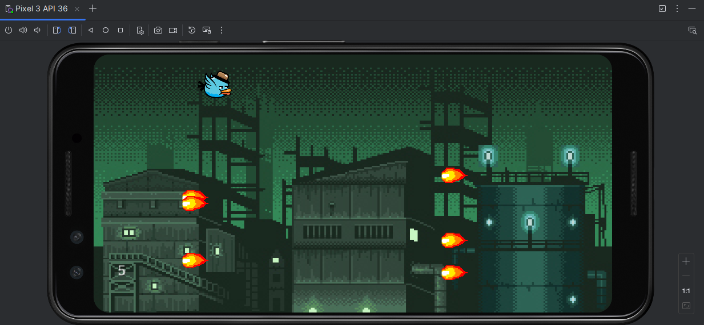

<h2>🎮 Survivor Bird</h2>

Bu proje, Java ve <strong>LibGDX</strong> kullanılarak geliştirilmiş bir mobil oyun uygulamasıdır. Oyunun amacı, bir kuşu kontrol ederek ekrandaki ateş toplarından kaçmaktır.

<h3>🧩 Özellikler</h3>
<ul>
  <li>🕹️ LibGDX ile geliştirilmiş 2D oyun</li>
  <li>🔥 Hareketli ateş toplarından kaçma mekaniği</li>
  <li>📈 Skor sistemi</li>
  <li>🕊️ Kuşun yerçekimi etkisiyle hareket etmesi</li>
  <li>💥 Gerçek zamanlı çarpışma kontrolü</li>
  <li>🔁 Oyun bittiğinde yeniden başlatma seçeneği</li>
</ul>

<h3>🛠️ Kullanılan Teknolojiler</h3>
<ul>
  <li><strong>Java</strong> – Ana programlama dili</li>
  <li><strong>LibGDX</strong> – Oyun motoru (rendering, input, collision, texture management)</li>
  <li><strong>Android Studio</strong> – Geliştirme ortamı</li>
</ul>

<h3>📱 Ekran Görüntüsü</h3>

<em>Oyun arayüzünden bir kare:</em>

<h3>🚀 Başlamak için</h3>
<pre>
1. Bu repoyu klonla:
   git clone https://github.com/kullaniciadi/survivor-bird.git

2. Android Studio ile projeyi aç.

3. Emülatör veya fiziksel cihazda çalıştır.
</pre>

<h3>👤 Geliştirici</h3>

<strong>Semih Şahin</strong> 
<a href="https://github.com/semjhsahjn" target="_blank">GitHub Profilim</a>

<h3>📄 Lisans</h3>

Bu proje açık kaynaklıdır. Detaylar için <code>LICENSE</code> dosyasına göz atın.

